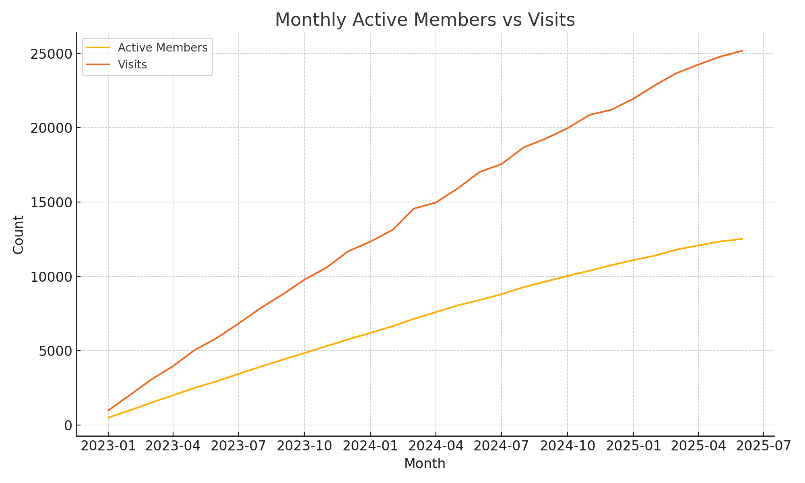
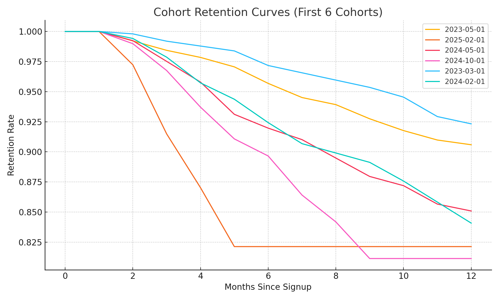

# 🎬 Cineville Data Analyst Portfolio Project

This portfolio project simulates the responsibilities of a **Data Analyst at Cineville**, showcasing skills in Python, SQL (BigQuery), data modeling, and visualization — all within the context of **film club engagement and member growth**.

---

## 🧩 Project Context

Cineville’s ecosystem connects 250+ film theaters with 160,000+ members across Europe. The core challenge for a data analyst here is to **turn raw usage data into insights** that support:
- Member retention
- Cinema performance
- Product evolution
- Strategic decision-making

This project builds a **realistic simulation** of such data and applies analytical techniques that generate answers to real business questions.

---

## 🧪 Note on the Data

> **This project uses synthetic data** that I created from scratch to simulate Cineville’s real-world ecosystem.  
It includes fictional members, visits, films, theaters, and payments — all designed to reflect realistic patterns.

Because the data is fabricated:
- The **results are illustrative**, not reflective of Cineville’s real metrics
- The **focus** is on showcasing **technical ability**, **business understanding**, and **data storytelling**

This also shows my ability to:
- Design datasets from scratch
- Simulate real-world business logic
- Build a full analytical workflow end-to-end

---

## 📊 Data Storytelling: From Raw Data to Insights

### 1. 📈 How are we growing, and who’s using Cineville?

**Monthly Active Members vs Visits**

> Are more members actually visiting cinemas, or just signing up and leaving?

Using `members.csv` and `visits.csv`, we track:
- **Monthly Active Members (MAM)**
- **Monthly Visits**



💡 **Insight**: There’s a strong alignment between active members and visits, suggesting that most users who keep their membership also use it. This metric helps tie growth to real engagement.

---

### 2. 🔁 Are members sticking around?

**Cohort Retention Analysis**

> How long do members typically stay active after joining?

Grouping users by their **join month**, we calculate how many remain active over 12 months.



💡 **Insight**: Some cohorts retain well beyond 6 months, while others drop sharply after 2–3 months. This insight could inform onboarding, early engagement strategies, or promotions.

---

### 3. 🏆 Which theaters are driving engagement?

Using `theater_performance.sql`, we:
- Rank theaters by total visit volume
- Identify key markets
- Guide future partnerships or campaigns

💡 **Insight**: Urban centers dominate visit counts, but some small cities overperform, pointing to potential niche audiences.

---

### 4. 📉 Where are we losing users?

**Churn Rate Analysis**

> What percentage of members cancel their subscriptions each month?

Using `churn_rate.sql`, we compute:
- Monthly churn rate
- Historical churn trends

💡 **Insight**: Churn stabilizes around the 4th month, suggesting a critical early phase in the member lifecycle. This helps prioritize customer success and retention marketing efforts.

---

## 📁 Deliverables

📂 `data/` – Synthetic CSV files for members, visits, films, theaters, and payments  
🧠 `scripts/analysis.py` – Python code to generate all visual insights  
📊 `visuals/` – Auto-generated dashboards (charts)  
🧮 `sql/` – BigQuery-ready SQL for KPI analysis  
📘 `README.md` 

---

## 🛠️ Tools & Stack

- **Python**: pandas, matplotlib
- **SQL**: Google BigQuery (Standard SQL)
- **Environment**: Designed for GCP
- **Version control**: GitHub

---

## 🚀 Run the Project Locally

```bash
# Clone the repo
git clone https://github.com/dimitrisdiam/cineville-portfolio.git
cd cineville-portfolio

# Create and activate virtual environment
python -m venv .venv
source .venv/bin/activate

# Install dependencies
pip install pandas matplotlib

# Run analysis to generate charts
python scripts/analysis.py
